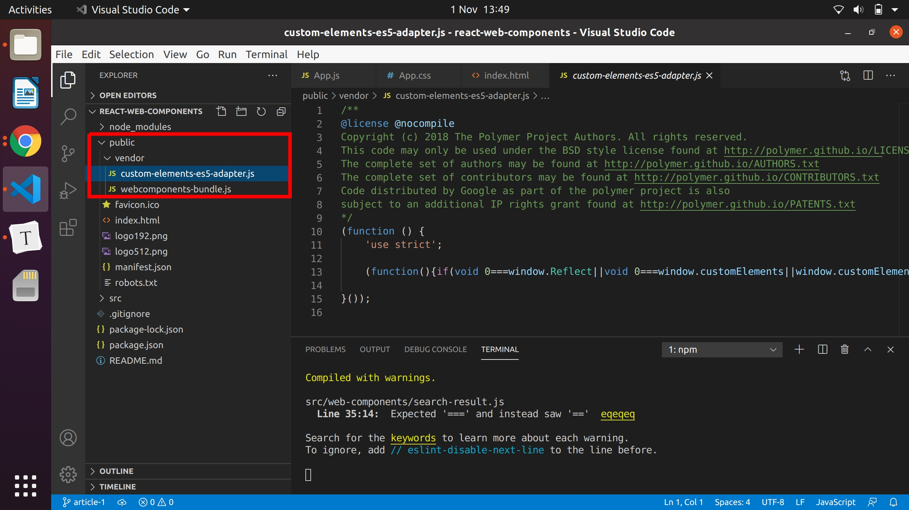
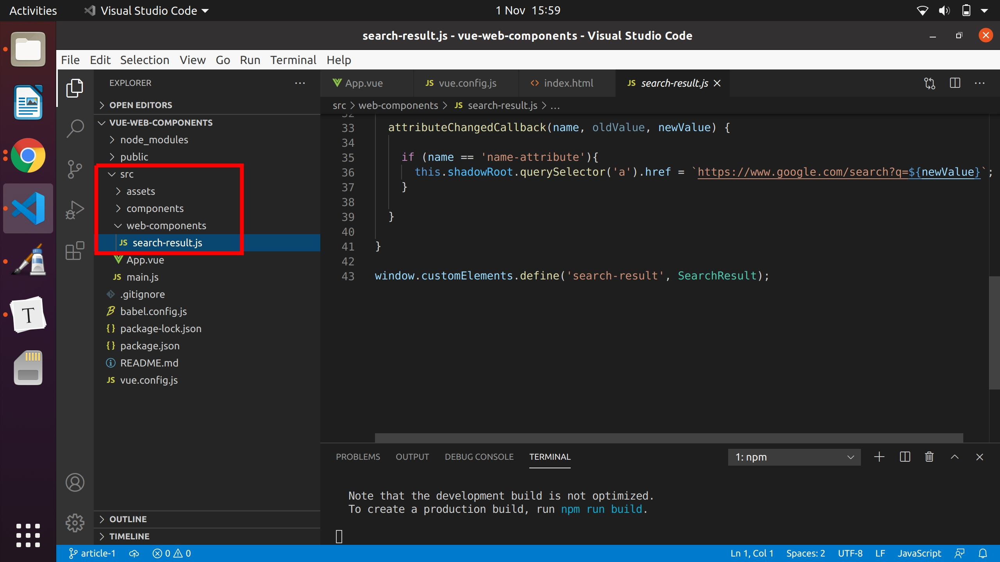

# Web Components for JavaScript frameworks

**Have you ever dreamed about sharing components between React , Vue and Angular apps?**

**It turns out it's possible, thanks to Web Components!!**

Lets get our hands dirty and build our first Web Component in Vanilla JavaScript and consume it in React, Angular and Vue apps!

Table of contents:  

- ###### [What are Web Components?](#What-are-web-components)

- ###### [Building our first Web Component with Vanilla JavaScript](#Building-our-first-Web-Component-with-Vanilla-JavaScript)

- ###### [Consuming the Web Component in React](#Consuming-the-Web-Component-in-React)

- ###### [Consuming the Web Component in Vue](#Consuming-the-Web-Component-in-Vue)

- ###### [Consuming the Web Component in Angular](#Consuming-the-Web-Component-in-Angular)

  

_-Special thanks to: [Nikos Tsokos](https://twitter.com/n_tsokos), member of [Scotland's Angular Meetup](https://www.youtube.com/channel/UCWIfQn9vUayDkzrrDIjdAjg) who inspired me to write this article,  [Gonzalo Aguirre](https://twitter.com/\_gonaguirre) Co-Founder & CTO of [Underscope](https://underscope.io) and my wife Sarah Acheson for reviewing it.-_

**Note: if you copy and paste code snippets, it's recommended to avoid including the top comment that tells the name of the file, like `//App.js` or `//index.html`, because they may break your app.**

## What are web components?

Web Components are a set of web platform APIs that allow you to **create new custom, reusable, encapsulated HTML tags** to use in web pages and web apps.

For example, we can create our new component called  `<my-web-component>`, with its unique styling and functionality, and use it in **any JavaScript framework or library** . And besides that, it works across **[most modern browsers!](https://caniuse.com/?search=web%20components)** Sounds too good to be true, doesn't it? 

The fact that these components are framework agnostic, makes creators of component libraries more profitable and future proof as well. This is why this is the next big thing and you should consider getting on board in these early days and take advantage of it.

If you want to have some extra reading, visit the official website of Web Components at [webcomponents.org](https://www.webcomponents.org/) and the MDN Docs at [developer.mozilla.org/en-US/docs/Web/Web_Components](https://developer.mozilla.org/en-US/docs/Web/Web_Components).


## Building our first Web Component with Vanilla JavaScript

First of all lets see the end result on the screen of the Web Component we're gonna build, the one inside the red rectangle:


So, the app consists of an input field, where you can type your name, and a greeting paragraph, outputting the name you entered, and below, a Web Component that gives you the Google search result of the name. If you click the link that says "here", you can see the search result opened in a new tab: 


After creating this Web Component, we're gonna build the same app in React, Vue and Angular, and consume it in each app.

To create the Web Component, lets open a code editor and create a `.js` file, that we can name `search-result.js` and paste this content there:

```javascript
//search-result.js

const template = document.createElement('template');
template.innerHTML = `
  <style>
    div {
      margin-top: 20px;
      color: green;
    }
  </style>
  <div>
    <p>The Google search result of your name is <a target="_blank" rel="noopener">here</a></p>
  </div>
`;

class SearchResult extends HTMLElement {

  constructor() {

    super();

    this.attachShadow({ mode: 'open' });

    this.shadowRoot.appendChild(template.content.cloneNode(true));

    this.shadowRoot.querySelector('a').href = '';

  }
    
  static get observedAttributes() {
     return ['name-attribute'];
  }

  
  attributeChangedCallback(name, oldValue, newValue) {
    
    if (name == 'name-attribute'){
      this.shadowRoot.querySelector('a').href = `https://www.google.com/search?q=${newValue}`;
    }

  }  
  
}

window.customElements.define('search-result', SearchResult);
```


You might be wondering what's all the code above about, so lets see each part step by step:

1) **Create the template:**

````
const template = document.createElement('template');
````

The first step is to create a **[HTML Content Template](https://developer.mozilla.org/en-US/docs/Web/HTML/Element/template)** (`<template>`) element, which is a mechanism for holding [HTML](https://developer.mozilla.org/en-US/docs/Glossary/HTML) that is not to be rendered immediately when a page is loaded but may be instantiated subsequently **during runtime using JavaScript**. This `<template>` element can be created with an API provided by the browser `document.createElement()`, that when passed a string with the name of the element we want to create, it returns it. To know more, click [here](https://developer.mozilla.org/en-US/docs/Web/API/Document/createElement).


2) **Fill the template:**

```
template.innerHTML = `
  <style>
    div {
      margin-top: 20px;
      color: green;
    }
  </style>
  <div>
    <p>The Google search result of your name is <a target="_blank" rel="noopener">here</a></p>
  </div>
`;
```

This template element is stored in a variable called `template` that has some properties and one of them is [innerHTML](https://www.w3schools.com/jsref/prop_html_innerhtml.asp) which sets the HTML content of the element. There, we can add the HTML we want to display on the screen, like `<div>  `, `<p>`, `<a>` and any other elements.


3) **Create an HTMLElement:**

```javascript
class SearchResult extends HTMLElement { }
```

Once we got our template ready, we need JavaScript to instantiate it, and this can be done extending an interface called [HTMLElement](https://developer.mozilla.org/en-US/docs/Web/HTML/Element/template), creating our custom HTML element.

If you are a bit lost here, but you have worked with React, remember when you extended `React.Component` to create a class based component in React. Here, we're extending the [HTMLElement](https://developer.mozilla.org/en-US/docs/Web/HTML/Element/template) interface instead, which is native browser API, and not a class or interface from the React library.


4) **Encapsulate the HTMLElement, append the template, and initialize the `href` value of the `<a>`:** 

```javascript
constructor() {

    super();

    this.attachShadow({ mode: 'open' });

    this.shadowRoot.appendChild(template.content.cloneNode(true));

    this.shadowRoot.querySelector('a').href = '';

  }
```

The constructor of the parent interface needs to be called to inherit all the methods and properties using the method `super()`. If you have used React in the early days, `super()` was required when creating a class based component. This `constructor()` runs right away when the component is created at runtime.

To recap, we have already created the template and the HTML element. Now, it's time to use the [shadow DOM](https://developer.mozilla.org/en-US/docs/Web/Web_Components/Using_shadow_DOM) to provide encapsulation — which means being able to keep the markup structure, style, and behavior hidden and separate from other code on the page so that different parts do not clash, and the code can be kept nice and clean. The Shadow DOM API is a key part of this, providing a way to attach a hidden separated DOM to an element.

This step of using the [shadow DOM](https://developer.mozilla.org/en-US/docs/Web/Web_Components/Using_shadow_DOM) is optional, but it's the usual way of writing clean components.

To attach the [shadow DOM](https://developer.mozilla.org/en-US/docs/Web/Web_Components/Using_shadow_DOM) to an element, there's a method called [`attachShadow()`](https://developer.mozilla.org/en-US/docs/Web/API/Element/attachShadow) which accepts an object with a key value pair `mode: 'open'`,  to set the *encapsulation mode* for the shadow DOM tree. When is `open`, the elements of the shadow root are accessible from JavaScript outside the root, for example using [`Element.shadowRoot`](https://developer.mozilla.org/en-US/docs/Web/API/Element/shadowRoot). 

In other words, when writing in Vanilla JavaScript, we access the DOM elements with the document object, like for example `document.querySelector('#title')`; to select an element with `id='title`; now, our Web Component will live inside the [shadow DOM](https://developer.mozilla.org/en-US/docs/Web/Web_Components/Using_shadow_DOM) (not at the main DOM tree root level) so we CAN'T use the document object, but the [shadowRoot](https://developer.mozilla.org/en-US/docs/Web/API/ShadowRoot) object instead, which is the interface of the Shadow DOM API and is the root node of a DOM subtree that is rendered separately from a document's main DOM tree.

So, now, we can access the web component at runtime with the [shadowRoot](https://developer.mozilla.org/en-US/docs/Web/API/ShadowRoot) object and the Web Component's content stored in the `template` variable, and we can attach and remove event listeners, and so on.

The line of code holding ` this.shadowRoot.appendChild(template.content.cloneNode(true));` deep clones all the content of the template and appends it as a child to our Web Component. More info about it [here](https://developer.mozilla.org/en-US/docs/Web/API/Node/cloneNode).

The `href` attribute can't be hard-coded, because it depends on what the user types inside the input field for the name. So, this content must be added at runtime and, as a consequence, the `<a>` element must also be accessed at runtime and have its `href` attribute value initialized with this code: `this.shadowRoot.querySelector('a').href = '';`


5) **Declare the watched attributes:**

The app will pass the dynamic name via one attribute called `name-attribute` , but Web Components don't watch for attribute value changes by default, so this must be done manually with a static method:  

```javascript
static get observedAttributes() {
   return ['name-attribute'];
}
```

In the returned array, all the names of the attributes we want to watch for must be added.


6) **React to changes in attribute values:**

Inside our Web Component, there's a method `attributeChangedCallback()` available, that runs every time any of the watched attributes change. 

```javascript
attributeChangedCallback(name, oldValue, newValue) {
    if (name == 'name-attribute'){
      this.shadowRoot.querySelector('a').href = `https://www.google.com/search?q=${newValue}`;
    }
}  
```

The `attributeChangedCallback()` method has three arguments: the `name` of the attribute that changed and triggered the method, the attribute `oldValue` and `newValue`.

The `if` could be omitted in this case because we only have one attribute watched for, but in general, there might be more than one and we want to react in different ways depending on which one changed. Another nice approach is to use a `switch` statement instead.

The piece of code above generates a Google search query holding the dynamic `newValue`.


7) **Let the browser know about our new custom Web Component:**

Our Web Component has already been created, but one more step is missing. The browser only knows about the default HTML elements like `<div>`, `<p>` and so on, but it doesn't know what a `<search-result>` tag is, for example. To let the browser know about it, we need to interact with the [CustomElementRegistry](https://developer.mozilla.org/en-US/docs/Web/API/CustomElementRegistry) which can be instantiated and accessed via `window.customElements` and then access the [define()](https://developer.mozilla.org/en-US/docs/Web/API/CustomElementRegistry/define) method inside it:

 ```javascript
window.customElements.define('search-result', SearchResult);
 ```

The first argument we pass to it is the name of the new custom element. **Note that custom element names must contain a hyphen** (it can't be named `searchresult`), and the second one is the constructor of  the new custom element.

**That's it! we have successfully created our first web component that can be used in any JavaScript framework or library! wow!**


**Bonus:**

There are other life-cycle methods available inside a Web Component, and these are:

- `connectedCallback`: Invoked when the custom element is first connected to the document's DOM.
- `disconnectedCallback`: Invoked when the custom element is disconnected from the document's DOM.
- `adoptedCallback`: Invoked when the custom element is moved to a new document.

You can know more about them [here](https://developer.mozilla.org/en-US/docs/Web/Web_Components).


## Consuming the Web Component in React

React is the most popular Front End library used nowadays to build apps. So, lets create a React project and consume our Web Component. The final React app can be found in this [gitHub repo](https://github.com/estebanmunchjones2019/react-web-components). Lets follow these steps:

1) **Create the App**

Let's call the app `react-web-components`. Feel free to choose other name as well. In any folder, type these commands, one at a time:

````
npx create-react-app react-web-components
cd react-web-components
npm start
````

You'll see the following on `localhost:3000` in your browser:


2) **Add our Web Component to the App**,  by copying the `search-result.js`  file containing our component inside, and paste it inside a folder that we'll call `web-components` inside the `src` folder of the project. So, the web-component will be located at `/src/web-components/search-result.js`.


3) **Modify `/src/App.js`** by pasting this code inside:

```javascript
//App.js

import { useState } from 'react';

import './App.css';
//import our Web Component
import './web-components/search-result';

function App() {

  const [name, setName] = useState('');

  return (
    <div className="App">
      
      <input 
      placeholder="Enter your name" 
      onChange={(event) => setName(event.target.value)}
      value={name}></input>

      <div class="greeting">Hello {name}!</div>

      <search-result name-attribute={name}></search-result>

  </div>
  );
}

export default App;
```

The code above stores the value from the `<input>` field in the state and passes it to our Web Component `<search-result>`  via the attribute called `name-attribute` . 


4) **Modify `/src/App.css`**, by adding this lines of code to give the app a better look.

```css
//App.css

.App {
  text-align: center;
  margin-top: 30px;
}

.greeting {
  margin-top: 20px;
}

```


5) **Add two polyfills to get browser support and to use Web Components in ES5 transpiled code:**

The following steps are extracted from a [tutorial](https://vaadin.com/learn/tutorials/using-web-components-in-react) at [vaadin.com](https://vaadin.com):

Although most modern browsers ship with built-in support for Web Components, there are still users out there with older browsers. If you want to make your app available to them as well, you need to include *polyfills* that emulate the functionality in browsers without native support.

To know more about these polyfills, check out this [gitHub repo](https://github.com/webcomponents/polyfills/tree/master/packages/webcomponentsjs).

We use the `webcomponentsjs` polyfills and we also make use of `vendor-copy` to make the polyfills available on runtime. 

a) Let’s start by installing them. Open the terminal and run this command:

```bash
npm install --save @webcomponents/webcomponentsjs vendor-copy
```

b) Open `package.json`  located at the root level of your project, to enable `vendor-copy`. To the `scripts` block inside `package.json`, add a `postinstall` which runs `vendor-copy` after every time `npm install` is invoked.

```json
//package.json

"scripts": {
  "start": "react-scripts start",
  "build": "react-scripts build",
  "test": "react-scripts test",
  "eject": "react-scripts eject",
  "postinstall": "vendor-copy" 
},
```

c) Next, at the end of the same file, give instructions to `vendor-copy` on what it should copy over when the install is run. We need `webcomponents-bundle.js` and `custom-elements-es5-adapter.js`.

```json
//package.json

"vendorCopy": [
  {
    "from": "node_modules/@webcomponents/webcomponentsjs/custom-elements-es5-adapter.js",
    "to": "public/vendor/custom-elements-es5-adapter.js"
  },
  {
    "from": "node_modules/@webcomponents/webcomponentsjs/webcomponents-bundle.js",
    "to": "public/vendor/webcomponents-bundle.js"
  }
]
```

d) Run this command in the terminal:

```bash
npm install
```

After this process finished, you'll see a `/public/vendor` folder that has been created. You'll have two files inside it: `custom-elements-es5-adapter.js` and `webcomponents-bundle.js`. 



e) Lastly, we have to use the polyfills at runtime by adding them to our `/public/index.html`. Add the following lines to the end of `<body>` inside `index.js` file:

````
//index.js

<script src="%PUBLIC_URL%/vendor/webcomponents-bundle.js"></script>
<script>if (!window.customElements) { document.write("<!--"); }</script>
<script src="%PUBLIC_URL%/vendor/custom-elements-es5-adapter.js"></script>
<!--! DO NOT REMOVE THIS COMMENT, WE NEED ITS CLOSING MARKER -->
````

6) **Verify that you can run the application** by running this in the command line:

````bash
npm start
````

Open the browser on `localhost:3000` and you'll see this:


That's it! **Our React app uses our custom Web Component now! Well done!** 


## Consuming the Web Component in Vue

Vue is a modern an awesome framework growing in popularity these days. So, lets create a Vue project and consume our Web Component. The final Vue app can be found in this [gitHub repo](https://github.com/estebanmunchjones2019/vue-web-components). Lets follow these steps:

1) **Install the Vue CLI globally:**

Open your terminal and run this command:

```bash
npm i -g @vue/cli
```

If you get an error telling you that there aren't permissions to access certain folders, just add the word `sudo` before the command, and enter your credentials.

2) **Create a new Vue project:**

Still in the terminal, run these commands (one at a time) to create a project called `vue-web-components`; feel free to choose other name as well.

```bash
vue create vue-web-components
cd vue-web-components
npm run start
```

If you open the browser and go to `localhost:8080`, you should see this:


3) **Add our Web Component to the App**,  by copying the `search-result.js`  file containing our component, and paste it in inside a folder that we'll call `web-components` inside the `src` folder of the project. So, the web-component will be located at `/src/web-components/search-result.js`.




4) **Modify `/src/App.vue`** file by replacing its default content with this code:

```vue
//App.vue

<template>
  <div class="App">
    
      <input 
      placeholder="Enter your name" 
      v-model="name">
      

      <div class="greeting">Hello {{ name }}!</div>

      <search-result v-bind:name-attribute="name"></search-result>
  </div>
</template>

<script>
  //import our Web Component
  import './web-components/search-result.js';
  
  export default {

    data() {
      return {
        name: '' 
      }
  } 

  }
</script>   

<style>
.App {
  margin-top: 30px;
  text-align: center;
}
.greeting {
  margin-top: 20px;
}
</style>
```


5) **Add two polyfills to get browser support and to use Web Components in ES5 transpiled code:**

The following steps are extracted from a [tutorial](https://vaadin.com/learn/tutorials/using-web-components-in-vue?hss_channel=lcp-52231&utm_campaign=Learning%20Center&utm_medium=social&utm_source=linkedin&utm_content=81560915) at [vaadin.com](https://vaadin.com):

a) Install the polyfills:

The [webcomponents.js](https://github.com/webcomponents/webcomponentsjs) polyfill comes with a loader script that can be used to load only the polyfills a particular browser needs. It loads the polyfills dynamically so it cannot be imported directly as a JS dependency that gets built by Webpack. Instead, you need to copy over the dependencies and include the loader in your index file. The library also contains an ES5 compatibility script for apps that have been transpiled into ES5.

To know more about these polyfills, check out this [gitHub repo](https://github.com/webcomponents/polyfills/tree/master/packages/webcomponentsjs).

Open the terminal and type this command:

``` bash
npm install --save-dev copy-webpack-plugin @webcomponents/webcomponentsjs
```

b) Copy the polyfills:

The first thing we need to do is copy over the polyfills. You can do this by providing Vue with an additional Webpack configuration. Create a new file, `vue.config.js` at the root of your project.

````javascript
//vue.config.js

const CopyWebpackPlugin = require('copy-webpack-plugin');

module.exports = {
  configureWebpack: {
    plugins: [
      new CopyWebpackPlugin({
          patterns: [
            {
                context: 'node_modules/@webcomponents/webcomponentsjs',
                from: '**/*.js',
                to: 'webcomponents'
              }
          ]
        
        })
    ]
  }
};
````


The `CopyWebpackPlugin` will now copy over all the needed JavaScript files into a `webcomponents` directory in the `dist` directory when building the app. 

c) Load polyfills:

Then, include the loader and an optional import for the ES5 compatibility script in the `<head>` section of `/public/index.html`.

```html
//index.html

<script src="webcomponents/webcomponents-loader.js"></script>
<script>
  if (!window.customElements) { document.write('<!--'); }
</script>
<script src="webcomponents/custom-elements-es5-adapter.js"></script>
<!-- ! DO NOT REMOVE THIS COMMENT, WE NEED ITS CLOSING MARKER -->
```


6) **Verify that you can run the application** by running this in the command line:

````bash
npm run serve
````

Open the browser on `localhost:8080` and you'll see this:


That's it! **Our Vue App uses our custom Web Component now! Congratulations!** 


## Consuming the Web Component in Angular

Angular is a well established framework that shines at the enterprise level. So, lets create an Angular project and consume our Web Component. The final Angular app can be found in this [gitHub repo](https://github.com/estebanmunchjones2019/angular-web-components).

1) **Install the Angular CLI globally:**

Open your terminal and run this command:

```bash
npm i -g @angular/cli
```

If you get an error telling you that there aren't permissions to access certain folders, just add the word `sudo` before the command and enter your credentials.


2) **Create a new Angular project:**

Still in the terminal, run this commands (one at a time) to create a project called `angular-web-components`; feel free to choose other name as well.

```bash
ng new angular-web-components
cd angular-web-components
ng serve
```

If you open the browser and go to `localhost:4200`, you should see this:


3) **Add our Web Component to the App**,  by copying the `search-result.js`  file containing our component, and paste it in inside a folder that we'll call `web-components` inside the `/src/app` folder of the project. So, the web-component will be located at `/src/app/web-components/search-result.js`.


4) **Modify the `/src/app/app.module.ts` file:**

To use two way data binding in our `<input>` element, lets add the `FormsModule` to the `imports` array.

Angular will NOT recognize by default our custom HTML tag of our Web Component, so lets add a `schemas` property inside the `@NgModule` decorator, and add `CUSTOM_ELEMENTS_SCHEMA` inside the `schemas` array. The code should look like this:

```typescript
//app.module.ts

import { BrowserModule } from '@angular/platform-browser';
import { NgModule, CUSTOM_ELEMENTS_SCHEMA } from '@angular/core';
import { FormsModule } from '@angular/forms';

import { AppComponent } from './app.component';

@NgModule({
  declarations: [
    AppComponent
  ],
  imports: [
    BrowserModule,
    FormsModule
  ],
  providers: [],
  schemas: [CUSTOM_ELEMENTS_SCHEMA],
  bootstrap: [AppComponent]
})
export class AppModule { }
```


5) **Modify `/src/app/app.component.html`**  by replacing its default content with this code:

```html
//app.component.html

<div class="App">
      
  <input 
  placeholder="Enter your name" 
  [(ngModel)]="name"
  >

  <div class="greeting">Hello {{name}}!</div>

  <search-result [attr.name-attribute]="name"></search-result>

</div>  

```


6) **Modify `/src/app/app.component.css`** by adding this content inside:

```css
//app.component.css

.App {
   text-align: center;
   margin-top: 30px;
}
  
.greeting {
   margin-top: 20px;
}
```


7) **Modify `/src/app/app.component.ts`** by adding this content inside:

```typescript
//app.component.ts

import { Component } from '@angular/core';
//import our Web Component
import './web-components/search-result.js';

@Component({
  selector: 'app-root',
  templateUrl: './app.component.html',
  styleUrls: ['./app.component.css']
})
export class AppComponent {
  name;
}
```


8) **Add the polyfills:**

if you skipped the React and Vue sections and you don't know about what these polyfills are, read about them, above, in the step 5 of the React and Vue sections.

To know more about these polyfills, check out this [gitHub repo](https://github.com/webcomponents/polyfills/tree/master/packages/webcomponentsjs).

The following steps were copied from a [tutorial](https://vaadin.com/learn/tutorials/using-web-components-in-angular) at [vaadin.com](https://vaadin.com).

a) Run this code in the terminal:

``` bash
npm install --save-dev @webcomponents/webcomponentsjs
```

b) You need to copy over the polyfills to load them. You can do this by adding them to the `assets` array in `angular.json` located at the root level of your project. Now, your `assets` array should look like this:

```json
//angular.json

"assets": [
"src/favicon.ico",
"src/assets",
{
  "glob": "**/*.js",
  "input": "node_modules/@webcomponents/webcomponentsjs",
  "output": "webcomponents/"
}
```

c) Then, include the loader and an optional import for the ES5 compatibility script in the `<head>` section of `/src/index.html`.

```html
//index.html

<script src="webcomponents/webcomponents-loader.js"></script> 
<script>
  if (!window.customElements){document.write('<!--');}
</script>
<script src="webcomponents/custom-elements-es5-adapter.js"></script>
<!-- ! DO NOT REMOVE THIS COMMENT, WE NEED ITS CLOSING MARKER -->
```


9) **Verify that you can run the application** running this command on the terminal:

```bash
ng serve
```

If you open the browser and go to `localhost:4200` you should now see:


That's it! **Our Angular App uses our custom Web Component now! Excellent!** 


This was just an introductory article about Web Components, so I encourage you to keep exploring and experimenting. **Have fun and happy coding!**